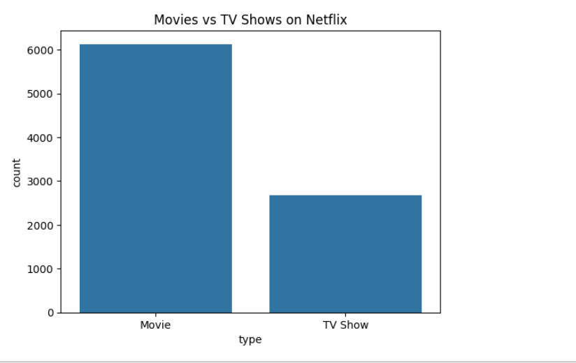
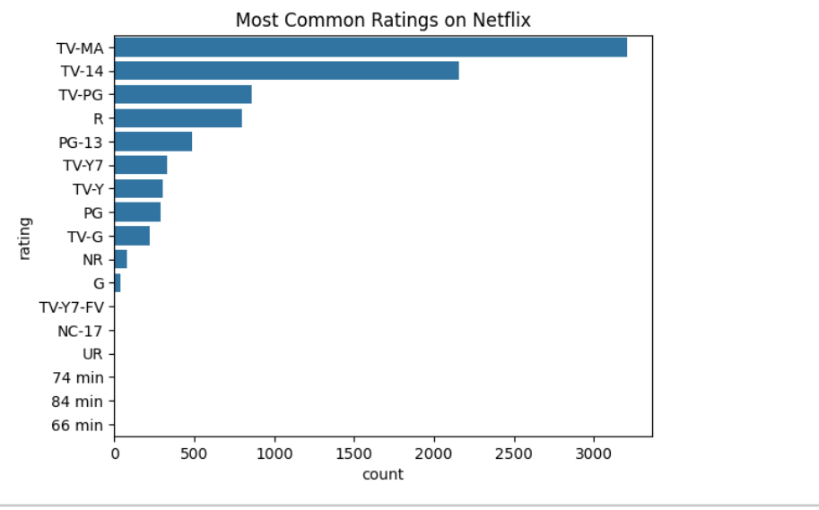
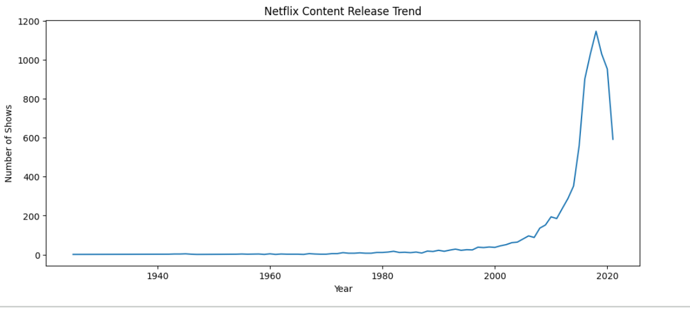
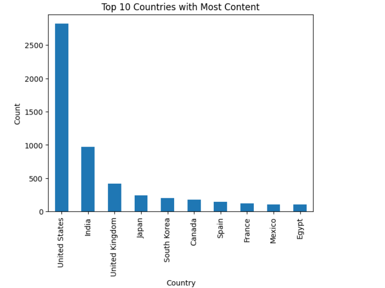
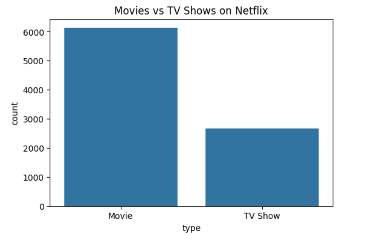
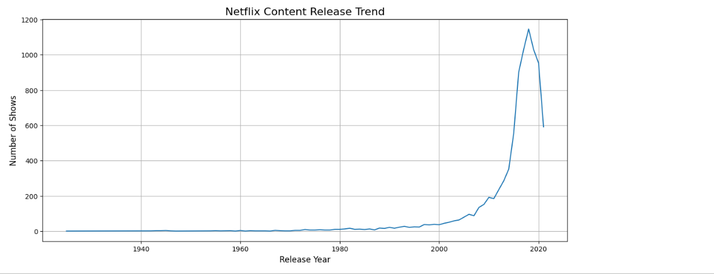
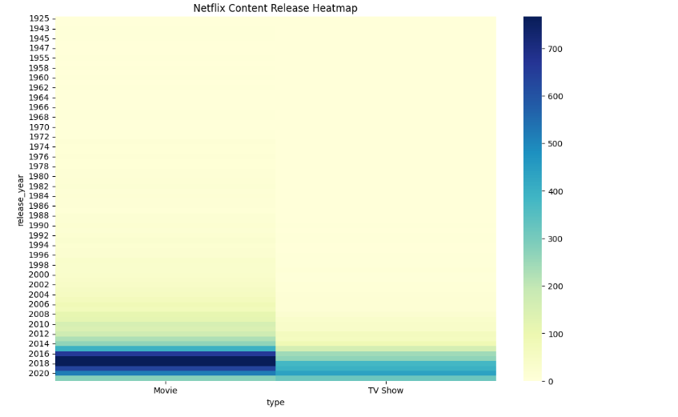
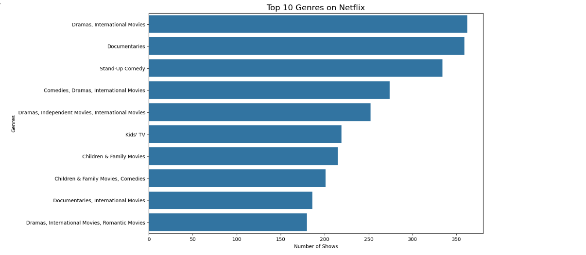
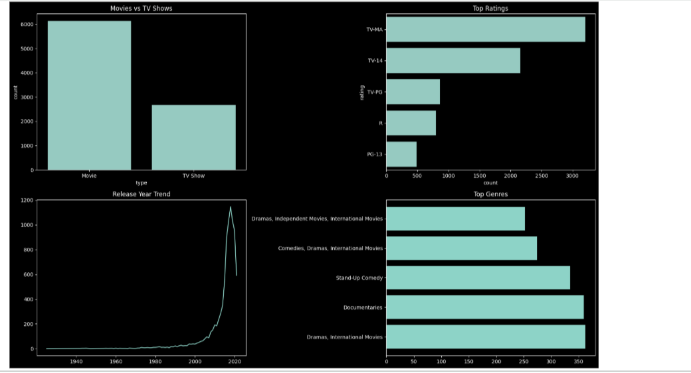

# Netflix-EDA-Project

## Project Overview:

This project performs Exploratory Data Analysis (EDA) on the Netflix dataset using Python.  
The analysis focuses on understanding Netflix content trends, genres, ratings, release patterns, and country-wise distribution.

The project was created using real-world Netflix data from Kaggle and aims to extract meaningful business insights through data visualization.

## Project Objectives:

- Analyze Movies and TV Shows on Netflix
- Identify the most popular genres
- Study release year trends
- Analyze audience ratings
- Discover top contributing countries
- Create meaningful visualizations

## Tools & Technologies Used:

- Python
- Pandas
- NumPy
- Matplotlib
- Seaborn
- Google Colab
- GitHub

## Dataset Information

- Dataset: `netflix_titles.csv`
- Source: Kaggle
- Total Rows: 8807
- Total Columns: 12

  # Data Cleaning

The following preprocessing steps were performed:

- Checked missing values
- Handled null values using `fillna()`
- Removed unnecessary missing records using `dropna()`
- Checked duplicate records
- Prepared dataset for analysis

  # Exploratory Data Analysis

The following analyses were performed:

## Movies vs TV Shows
- Compared content distribution between Movies and TV Shows

## Top Countries
- Identified countries with the highest Netflix content

## Ratings Analysis
- Analyzed the most common audience ratings

## Genre Analysis
- Identified the most popular Netflix genres

## Release Year Trends
- Analyzed Netflix content growth over time

## Heatmap Analysis
- Visualized content trends using heatmaps

## Dashboard Visualization
- Created a professional Netflix-style dashboard

  # Key Insights

  - Movies dominate Netflix content
  - TV-MA is the most common rating
  - The United States contributes the highest amount of content
  - Drama and Comedy are highly popular genres
  - Netflix content production increased rapidly after 2015

### Movies vs TV Shows

---

### Most Common Ratings

---

### Netflix Content Release

---

### Top 10 Countries

## ✅ After Data Cleaning

### Movies vs TV Shows Analysis

---

### Netflix Release Trend

---

### Heatmap Analysis

---

### Top Genres Analysis

---

### Netflix Dashboard Visualization

  

